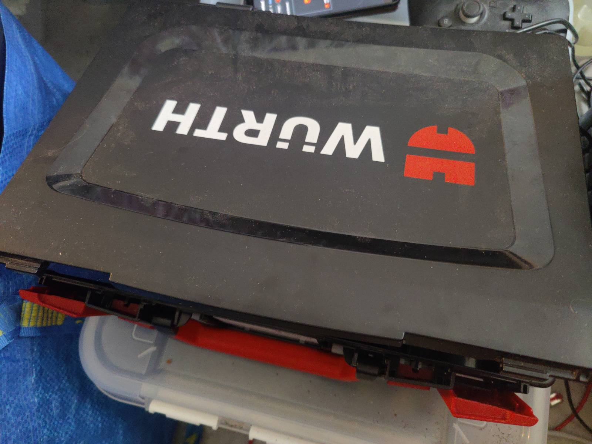
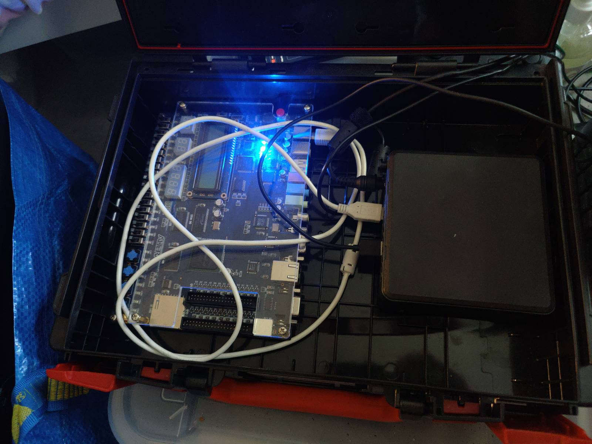
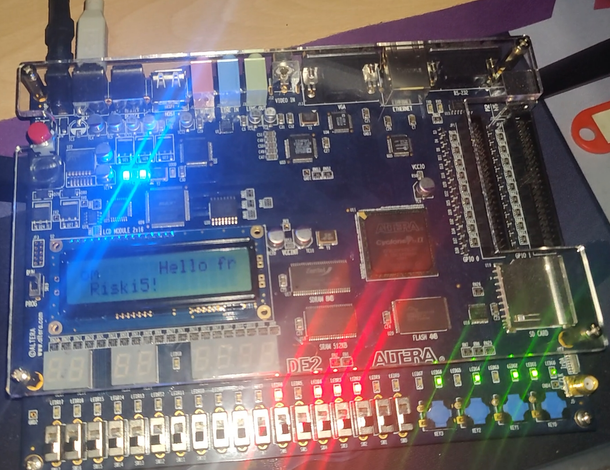

## How I created my first RISC-V processor {.title-deck}

Mika Tammi

# Section 1 · Introduction

## riski5 — RISC-V on FPGA in Haskell

**Helsinki Functional Programming meetup**
**2026-05-05**

<div style="height: 2em"></div>

A RISC-V processor written in Clash.

Clash compiles a subset of Haskell to synthesisable Verilog.

<div style="height: 2em"></div>

<https://github.com/purefunsolutions/riski5>

<https://github.com/purefunsolutions/riski5-helsinki-functional-programming-meetup-presentation>

## About me — Mika Tammi

- Long-time Haskeller, also enthusiastic about Nix and Rust; runs Pure Fun Solutions
- Background spans **embedded and systems programming**,
  **signal processing**, **ML / AI**, and **cybersecurity**
- Studied at **Tampere University of Technology** (BSc + an
  almost-MSc) — major in **Theoretical Computer Science**
  (*ohjelmistotiede*), minors in **Digital Hardware Design** and
  **Signal Processing in Multimedia**. Master's thesis still
  unfinished. Last touched FPGAs around **2012**, so this is a
  return after a decade-plus gap
- Audacious goal for this project:
  *write a RISC-V processor in Clash that runs on a 22-year-old
  educational FPGA*

## Sibling projects

- **`alterade2-flake`** — Quartus II 13.0sp1 + USB-Blaster on NixOS
- **`verilambda`** — Haskell-Verilator bindings, type-preserving
- **`riski5`** — the RISC-V core (today's main subject)

## ▶ Presenter reminder — kick off the live boot {.presenter-note}

In another terminal, before continuing:

```sh
nix run .#boot-linux-master-combmd
```

Uploads the kernel + DTB over JTAG-Avalon-Master and starts booting
Linux on the DE2 in the background while the rest of the deck plays.

## The setup driving today's demo {.full-photo}



## The setup driving today's demo {.full-photo}



## Why now? — AI + nostalgia

- **Claude Opus 4.7 was released 2026-04-16.** I wanted to push and
  test the limits of it on a substantial, end-to-end systems project.
- I dug up an old **Altera DE2** board I originally got from
  **Tampere University of Technology** as part of my studies.
  22 years old, 33 216 LEs, 8 MB SDRAM, sitting in a drawer.
- Open question: could Claude help me get this antique FPGA running
  on **modern NixOS + flakes**?
- I'd carried a years-old itch to write my own RISC-V core. Felt like
  the right time to try **Clash on real silicon**.
- Working style: **I supplied the design guidelines** — which blocks I
  wanted, what targets, what verification approach — **and Claude
  filled in the implementation gaps**. This whole project is the
  receipt for that experiment.

## Bootstrap: Hello World on real silicon in hours

**`alterade2-flake`** — Nix flake packaging Altera Quartus II 13.0sp1
(the last version that supports Cyclone II) and the USB-Blaster JTAG
cable as a NixOS module.

> A blinking-LED design was running on the physical DE2 within
> two hours of taking it out of the box and plugging it into my computer.

**`verilambda`** — Haskell-Verilator bindings, type-preserving
(HKD ports + `OverloadedLabels`), no Template Haskell. Built because
every existing option degraded Clash types at the FFI boundary.

**riski5** — the RISC-V core, sits on top of those two siblings.
Three repos, one workflow, all under Nix.

## Agenda + arc

Phase milestones (dates from the live blog post, not weeks):

- **Phase 1A** — Scaffold + type-level ISA *(2026-04-19)*
- **Phase 1B/C/D** — SoC bring-up: BRAM → SRAM → SDRAM
- **Phase 1E** — fmax baseline (~33 MHz pipelineless plateau)
- **Phase 2A** — 5-stage pipeline, **40 MHz on silicon** *(2026-04-21)*
- **Phase 2B** — A-extension + CLINT + PLIC + interrupts
- **2026-05-02** — **Linux 6.18.22 boots on real silicon** (dies at sched_clock)
- **2026-05-03** — Multi-PLL three-domain split landed
- **2026-05-04** — `mstatus.MPP` + bridge fixes; kernel reaches printk
- **2026-05-05 (today!)** — `cbrFlush` race + hybrid MUL-via-DSP
  silicon-only-bug fixes; Linux boots through `BogoMIPS` to
  **Mountpoint-cache hash table entries**

## How a CPU works (in 30 seconds) {.code-dense}

A CPU is a tiny state machine. Its state is the **program counter
(PC)**, the **register file** (32 GPRs in RV32), a few **CSRs**,
and **memory**.

Each clock tick:

1. **Fetch** — read 32 bits at `mem[PC]`
2. **Decode** — interpret them as an instruction
   (`addi x1, x2, 5` / `lw x3, 0(x4)` / `beq …`)
3. **Execute** — write a register, read / write memory, or update PC
4. **Repeat** — default `PC ← PC + 4`, then back to step 1

```haskell
step :: Instr -> MachineState -> MachineState
```

`Riski5.Reference` literally implements it that way — pure Haskell,
total function, no `IO`.

## What is Clash? {.code-dense}

Clash compiles a subset of Haskell to **synthesisable Verilog**.

- `Signal dom a` — a wire in clock domain `dom` carrying values of `a`
  over time
- `clash --verilog` — emit synthesisable Verilog
- `simulate` — run the same source as plain Haskell

```haskell
-- A single full adder
fullAdder
  :: Signal dom (Bit, Bit, Bit)
  -> Signal dom (Bit, Bit)
fullAdder = fmap step
  where step (a, b, cin) =
          (a `xor` b `xor` cin
          , (a .&. b) .|. (cin .&. (a `xor` b)))
```

**One source. Multiple targets.** That's the thread that runs through
this whole project.

## A quick word on RISC-V

**RISC-V** — an open, modular, royalty-free ISA, started in **2010**
at **UC Berkeley** (Asanović, Patterson, Waterman, Lee) as a clean
teaching ISA. First public spec in **2014**.

- **2015** — RISC-V Foundation incorporated; SiFive founded
- **2017** — HiFive Unleashed: first Linux-capable commercial board
- **2019** — RV32I / RV64I base + Zicsr ratified
- **2020** — RISC-V International moves to Switzerland for neutrality
- **2021** — Vector extension v1.0 ratified
- **2024-26** — major adoption: Google, Qualcomm, NVIDIA, Apple

## What riski5 implements today {.code-dense}

Full **RV32IMA + Zicsr + Zifencei + Zbb + M-mode** privileged subset:

- **RV32I** — base 32-bit integer ISA (47 instructions: arithmetic,
  logical, shifts, loads / stores, branches, jumps, FENCE, ECALL, EBREAK)
- **Zicsr** — six CSR access instructions (CSRRW / CSRRS / CSRRC + imm)
- **Zifencei** — `FENCE.I` (no-op without I-cache; free today)
- **M-mode privileged** — `mstatus`, `mtvec`, `mepc`, `mcause`,
  `mip` / `mie`, `MRET`; trap entry / return; CLINT timer + PLIC IRQs
- **RV32M** — `MUL`, `MULH`, `MULHSU`, `MULHU`, `DIV`, `DIVU`, `REM`, `REMU`
  (hybrid: combinational MUL via Cyclone II DSP blocks, iterative DIV/REM)
- **RV32A** — `LR.W`, `SC.W`, plus all nine AMOs:
  `SWAP / ADD / XOR / AND / OR / MIN / MAX / MINU / MAXU` (`.W`)
- **Zbb** — bit-manipulation (count-leading/trailing zeros, byte/word swap,
  `min`/`max`/`minu`/`maxu`, etc.) — required by Linux RV32 builds

# Section 2 · The Original Idea — RISC-V ISA at the Type Level

## The seed idea

> *Can I represent the entire RISC-V instruction set in Haskell's type
> system, and use that single definition for the hardware decoder, the
> assembler, and the encoder?*

This is what started the project.

The hypothesis: **if widths and operand kinds live in types, every
downstream consumer (silicon, simulator, assembler) is a total
function and bit-level mistakes become compile errors.**

Single source of truth. Three (or more) outputs. No duplication.

## Code excerpt: the `Instr` ADT {.code-dense}

From `Riski5.ISA` — every RV32IMA instruction is one constructor.

```haskell
data Instr
  = Lui   Reg (BitVector 20)        -- upper-immediate
  | Auipc Reg (BitVector 20)
  | Addi  Reg Reg (Signed 12)       -- I-type arithmetic
  | Slli  Reg Reg (BitVector 5)
  | Add   Reg Reg Reg               -- R-type arithmetic
  | Sub   Reg Reg Reg
  | Bne   Reg Reg (Signed 13)       -- branches
  | Jalr  Reg Reg (Signed 12)       -- jumps
  | Lw    Reg Reg (Signed 12)       -- loads / stores
  | Sw    Reg Reg (Signed 12)
  | Mul   Reg Reg Reg               -- RV32M
  | LrW   Reg Reg                   -- RV32A: load-reserved
  | ScW   Reg Reg Reg               -- RV32A: store-conditional
  | Csrrw Reg Csr Reg               -- Zicsr
  | Mret                            -- machine-mode return
  | Fence FenceArg FenceArg
  -- + ~30 more, each operand width-typed
```

Widths live in types — `Signed 12`, `BitVector 5`, `Reg = BitVector 5`.
A wrong width is a compile error before the synthesiser sees it.

## One ADT, three consumers {.code-dense}

```haskell
-- 1. Hardware decoder (Clash, runs on silicon)
decode :: BitVector 32 -> Maybe Instr

-- 2. Software encoder (inverse of decode, also total)
encode :: Instr -> BitVector 32

-- 3. Embedded assembler eDSL (monadic, with labels + pseudo-ops)
blinky :: Asm ()
blinky = do
  li   t0 0x10000020       -- pseudo-op: lui + addi
  loop <- label
  sw   t1 0 t0
  addi t1 t1 1
  j    loop                -- pseudo-op: jal x0, loop
```

Encoder/decoder mirror each other bit-for-bit. The assembler resolves
labels in two passes. **The first "Hello from Riski5" firmware was
written entirely in this Haskell eDSL — no GNU binutils involved.**

## "Hello from Riski5" — the asm eDSL on real silicon {.code-dense .two-col}

::::: columns
:::: column

```haskell
helloFirmware :: Asm ()
helloFirmware = do
  loadAddr uartReg 0x1000_0000
  loadAddr lcdReg  0x1000_0040

  uartString "hello, world\n"

  -- Centred LCD greeting
  lcdGotoXy 4 0
  lcdString "Hello fr"
  lcdGotoXy 0 1
  lcdString "Riski5!"

  done <- label
  j done
```

::::

:::: column



::::
:::::

# Section 3 · RTL Background

## A short history of silicon {.code-dense}

Moore's Law in concrete: feature size (*viivanleveys*) shrinking,
transistors per die exploding.

| Year | Process | Chip                                  | Transistors | Peak compute   |
|-----:|--------:|---------------------------------------|------------:|---------------:|
| 1971 |   10 µm | Intel 4004                            |       2.3 k |     0.09 MIPS  |
| 1978 |    3 µm | Intel 8086                            |        29 k |     0.33 MIPS  |
| 1993 |  800 nm | Intel Pentium                         |       3.1 M |   ~50 MFLOPS   |
| 2000 |  180 nm | Intel Pentium 4 (Willamette)          |        42 M |    ~6 GFLOPS   |
| **2004** | **90 nm** | **Altera Cyclone II — *the DE2*** | **33 k LE** |   *no FPU*     |
| 2006 |   65 nm | Intel Core 2 Duo (Conroe)             |       291 M |   ~48 GFLOPS   |
| 2013 |   22 nm | Intel Haswell                         |       1.4 B |  ~490 GFLOPS   |
| 2020 |   14 nm | **Intel i9-10900KF** — *my older desktop*|  ~6 B †  |   ~2 TFLOPS    |
| 2020 |    5 nm | Apple M1                              |        16 B |   2.6 TFLOPS   |
| 2022 | TSMC 4N | NVIDIA RTX 4090                       |      76.3 B |  82.6 TFLOPS   |
| 2023 | Intel 7 | **Intel i9-14900K** — *my desktop*    |    ~26 B †  |   ~3 TFLOPS    |
| 2023 |    3 nm | **Apple M3 Max** — *my MacBook Pro*   |        92 B |    14 TFLOPS   |
| 2025 | TSMC 4N | NVIDIA RTX 5090                       |      92.2 B | 104.8 TFLOPS   |
| 2026 |    N3P  | **Apple M5 Max** — *current bleeding edge* | ~165 B † |  ~25 TFLOPS    |
| 2026 |    2 nm | TSMC N2                               |   *ramping* |       —        |

*Peak compute: FP32 single-precision (CPU AVX or GPU, whichever
is higher); old chips show MIPS where no FPU existed.*
*† Intel never officially disclosed transistor counts for these
parts; figures are die-area-density estimates. M5 Max disclosure
is still pending at the time of writing.*

Feature size: **5 000× smaller** since 1971. Transistor density:
**~10⁷ ×**. Peak compute: **~10⁹ ×**. **riski5 fits comfortably
in 22-year-old 90 nm silicon.**

## From C to gates

A hardware description language (HDL) is **not** a programming language.

- **Registers** are physical state-holding elements (D flip-flops)
- **Combinational logic** between them is gates: AND, OR, MUX
- "Synthesisable" means a netlist tool can map your description to
  primitive logic cells the FPGA's place-and-route can chew on
- Every line of HDL **is happening in parallel, all the time** — there
  is no program counter

Mental model: your HDL describes a *circuit*. The simulator pretends
to be a clock and watches what wires do. The synthesiser turns the
description into actual silicon.

## HDL landscape — Verilog vs SystemVerilog vs VHDL

|            | Type system           | Tool support        | Ergonomics       |
|------------|-----------------------|---------------------|------------------|
| Verilog    | Weakest (4-state)     | Universal           | Spartan          |
| SystemVerilog | `logic`, structs, interfaces, assertions | Partial outside Synopsys/Cadence | Better |
| VHDL       | Strong, verbose       | Strong in EU/aerospace | Heavy ceremony |

**Verilator** — the gold-standard open-source simulator — only speaks
Verilog/SystemVerilog. That decided our synthesis target.

We use Clash → Verilog because Verilator was irreplaceable for the
test loop.

## The clock & propagation delay

```
   FF ──── combinational logic ────► FF
   ↑           (gates, muxes)        ↑
   │           ← propagation →       │
   └────── one clock period ─────────┘
```

The slowest combinational cone between two flip-flops sets your
**maximum clock frequency** (fmax).

Add another gate on the critical path → fmax drops.

Every "obvious" optimisation that adds logic depth (wider ALU, more
forwarding muxes, deeper decode) has a fmax cost.

## PLLs and multiple clock domains {.code-dense}

A real SoC is **not one clock**. The DE2 has a 50 MHz oscillator;
**Cyclone II PLLs** synthesise derived clocks at the frequencies and
phases each block needs.

riski5 (after the **Multi-PLL three-domain split, 2026-05-03**) has
**three independent clock domains**, each with its own PLL:

- **`DomBus`** — bus / fabric, **40 MHz**
- **`DomCore`** — CPU core, **40 MHz today** (CPP-tunable, splits
  from DomBus in a later phase)
- **`DomSdram`** — SDRAM controller, **50 MHz today** (chip-rated
  133 MHz; DE2 PCB chip-input timing doesn't close at 7.5 ns yet)

## Clock domain crossings (CDC) {.code-dense}

**CDC = Clock Domain Crossing.** When a signal travels between two
asynchronous clock domains, it can be *latched mid-transition* by
the receiver and resolve to a random value — *metastability*.
A **CDC bridge** sits on the boundary and synchronises every
crossing safely, usually via dual-flop synchronisers + a
handshake protocol.

riski5 has two:

- `Riski5.Cdc` wraps `dualFlipFlopSynchronizer` (the primitive)
- `Riski5.SdramCdcBridge` carries Avalon-MM traffic DomBus ↔ DomSdram
- `Riski5.CoreCdcBridge` does DomCore ↔ DomBus

**Clash makes this type-safe**: `Signal dom a` carries the domain
`dom` as a phantom type — the compiler rejects accidental
cross-domain wires.

## Pipelining buys you frequency

Single-cycle (Phase 1) ran into a ~33 MHz plateau in **Phase 1E**.

Splitting the datapath into a 5-stage pipeline (**Phase 2A,
2026-04-21**) raised the silicon target to **40 MHz**.

```
   F   |   D   |   X   |   M   |   W
 fetch | dec.  | exec. | mem.  | wb.
   ↓       ↓       ↓       ↓       ↓
   IF/ID  ID/EX  EX/MEM  MEM/WB
```

Trade-off: latency (each instruction takes 5 cycles to retire) and
**hazards** (forwarding paths, stalls, branch flushes).

# Section 4 · The riski5 SoC

## A core alone is useless — you need a SoC {.code-dense}

Phase 1A: BRAM inside the FPGA was the only memory; tiny hand-written
assembly programs (the eDSL from earlier!).

A working SoC needs **memory** *and* **MMIO** to even debug itself:

- **Memory:** BRAM 4 KB → async SRAM 512 KB → SDR SDRAM 8 MB
- **JTAG-UART** — host console over the USB-Blaster cable; no extra dongle
- **GPIO LEDs** — single-bit "did we get here?" probes
- **HD44780 LCD** — debug console before the UART worked
- **`JtagAvalonMaster`** — Clash bus master that pushes a Linux
  kernel + DTB into SDRAM over JTAG in seconds; no bitstream rebuild

Each memory step took longer than the core itself.

## SoC block diagram {.full-diagram}


## Memory map

| Region        | Base           | Size    | Notes |
|---------------|----------------|---------|-------|
| BRAM          | `0x0000_0000`  | 4 KB    | reset PC = 0 |
| MMIO          | `0x1000_0000`  | -       | UART, GPIO, LCD |
| CLINT         | `0x0200_0000`  | -       | SiFive layout |
| SRAM          | `0x2000_0000`  | 512 KB  | async, fast |
| SDRAM         | `0x8000_0000`  | 8 MB    | **Linux base** |

`Riski5.MemMap` is **the** source of truth. The SDRAM base is placed
where the RISC-V Linux port expects main memory, so reaching that
target is a layout question, not a re-addressing exercise.

## Core block diagram — 5-stage pipeline: F → D → X → M → W {.full-diagram}


## Performance vs old peers (CoreMark/MHz)

| Core                | CoreMark/MHz | Era |
|---------------------|--------------|-----|
| **riski5 (Phase 2A)** | **1.114**  | 2026 |
| Pentium I           | 1.0–1.5      | 1993 |
| Cortex-M0           | 0.95         | 2009 |
| Cortex-M3           | 1.96         | 2004 |
| Cortex-M4           | 3.40         | 2010 |

> **1.15 CoreMarks/MHz on silicon (multi-PLL build, 2026-05-03)** —
> 46 iterations / second at 40 MHz

A 5-stage in-order RV32IM lands in the same league as **1990s
superscalars**. First attempts already at Pentium-I class — without
much tuning.

# Section 5 · The Bring-Up Reality

## BRAM → SRAM → SDRAM

Each step harder than the last. The SDRAM bring-up uncovered a
**17-year-old Altera IP bug**:

> 2026-04-30 — *every upper-half-word write was dropped*

Fix: replace the vendor IP with our own pure-Clash SDR SDRAM
controller (2026-04-30 → 2026-05-01). Strictly tighter than the
firmware workaround we'd been carrying.

## Live silicon bugs are still being chased

The goal isn't a clean paper. The goal is shipping the truth.

- The pure-Clash SDRAM controller works on real silicon
- We are still chasing edge-case timing bugs on hardware
- The talk you're at is a **live progress report**, not a postmortem

This is what RTL feels like in practice. Software people, take heart:
the bugs are weirder, the iteration cycle is slower, and the
satisfaction when it finally works is correspondingly larger.

## Testbenches found nearly every bug {.code-dense}

The most fruitful debugging move was always **adding the next
testbench**. The Linux mid-init hang was hunted across ~10 refuted
hypotheses via `tools/linux-hwsim`. Three real HW bugs:

1. **SDRAM-bridge `dmem rdata` corruption**
2. **`mstatus.MPP` must be M-mode after `mret`** *(commit fa22903)*
3. **`CoreCdcBridge` flush race** — dropped a post-flush `lw`
   51 M cycles into a Linux boot *(commit 18d8b64)*

Some bugs live **below the sim layer**. Iterative MUL passes every
property + Spike-diff yet stalls on Cyclone II silicon → hybrid
MUL-via-DSP. **DIV looks the same** — current hypothesis is the
silicon DIV is what hangs Linux past `Mountpoint-cache`; likely
fix is a Newton-Raphson DSP divider.

**Sim correctness ≠ silicon correctness.**

## Correctness first, optimisation later

**Explicit policy in this phase**: *correctness > speed*.

- Land each piece working, then move on
- Optimisation only begins **after** the core is verifiably correct
  end-to-end and the testbench/verification stack is complete
- You cannot optimise what you cannot measure
- You cannot trust an optimisation without a known-good baseline

Phase 1 happily spent ~33 MHz on a single-cycle datapath; Phase 2A
only retimed once full coverage existed.

Future phases (deeper pipeline, branch prediction, caches) plug into
the same verification harness — every speed win is gated on
**continuing to pass the same proofs**.

# Section 6 · Type-Level Power

## `BitVector n`, `Vec n a`, `Signed n`

Width is in the type. Mismatch is a compile error, not a 4 a.m.
simulation crash.

```haskell
extend  :: BitVector 8  -> BitVector 32   -- compiler-checked
sliceLo :: BitVector 32 -> BitVector 16   -- compiler-checked

-- Vec n a: fixed-length vector at the type level
regs :: Vec 32 (BitVector 32)
```

Compare to Verilog where `wire [7:0] x; wire [31:0] y; assign y = x;`
silently zero-extends. Hours of debugging, gone.

## `regfileSync` vs `regfileAsync`

Two storage backings, **same interface signature**:

```haskell
-- FF-based: 1024 flip-flops, async-read, 0-cycle latency
regfileAsync
  :: HiddenClockResetEnable dom
  => Signal dom Reg                    -- rs1 addr
  -> Signal dom Reg                    -- rs2 addr
  -> Signal dom (Maybe (Reg, BitVector 32))  -- rd write
  -> ( Signal dom (BitVector 32)             -- rs1 data
     , Signal dom (BitVector 32) )           -- rs2 data

-- M4K-based: 2 block-RAMs, sync-read, 1-cycle latency
regfileSync :: ... (same signature) ...
```

Choose **at the type level** depending on whether the core is
pipelined. Same callers, same tests, different silicon footprint.

## Future: type-level core family

`docs/core-family.md` sketches a single `CoreConfig` type producing
preset cores from one source:

- `tiny32` — in-order 2–5 stages, DE2 target
- `little32Minimal` — 1-issue OoO, DE2-115 target
- `mid32` — 3-wide OoO, Sv32 Linux
- `big64` — 3-wide + L2 cache
- `performance128` — 4–6-wide TAGE, Sv39 (speculative XLEN=128)

Every extension a separate type-level toggle.
Degenerate modes collapse to **zero area** — `RenameNone` → wires.

## SoC configured at the type level too {.code-dense}

The same idea scales up to the *whole SoC*. The DE2 build is
literally one `SocConfig` value; another board fits the same shape:

```haskell
data SocConfig = SocConfig
  { socCore   :: CoreConfig         -- which CPU tier
  , socBusHz  :: KnownNat n => SNat n   -- bus clock
  , socSdram  :: Maybe SdramSpec    -- 8 MB on DE2; Nothing elsewhere
  , socUart   :: UartChoice         -- AlteraJtag | ClashUart16550
  , socExtras :: '[Lcd, Gpio, JtagAvalonMaster, Plic]
  }

de2 :: SocConfig
de2 = SocConfig tiny32 (SNat @40_000_000)
                (Just sdramDe2) AlteraJtag
                '[Lcd, Gpio, JtagAvalonMaster, Plic]
```

Swap a board → swap a record. Add a peripheral → extend a type-level
list. Same Clash core, different silicon target, type-checked
end-to-end.

# Section 7 · One Source, Multiple Artifacts

## The diagram {.full-diagram}


## Pure-Haskell reference

`Riski5.Reference` — the entire RV32I + Zicsr + M-mode + RV32A + RV32M
ISA implemented as a **plain Haskell function**:

```haskell
step :: Instr -> MachineState -> MachineState
```

Total. No `IO`. No `unsafePerformIO`. No FFI.

Hedgehog properties differentially test it against the Clash core: feed
the same instruction sequence into both, compare resulting states.

Layer 1 of the verification stack catches bugs in the **semantics** of
the Clash source.

## Why we built verilambda

Existing option: **clashilator**.

- Last release **April 2024**
- 700 downloads on Hackage (a single conference slide)
- Uses unsafe Template Haskell internally
- Critically: **degrades Clash types at the FFI boundary**
  — `BitVector 8` becomes `Word8`, width safety lost

No alternative had adequate types. So we built one.

> verilambda is the receipt for taking types seriously even at the
> Verilator boundary.

## Copilot — stream eDSL for the boot ROM {.code-dense}

A fifth artifact path: **Haskell → C → RV32 binary**.

[**Copilot**](https://copilot-language.github.io/) — a Haskell
stream eDSL by **NASA / Galois**, designed for safety-critical
runtime monitoring. We reuse it to *generate* the SDRAM-loader
state machine instead of hand-writing C.

- **Bounded execution** — every tick does fixed work, no allocation,
  no recursion → tiny RV32 binary
- **`copilot-theorem`** lets you prove invariants ("loader never
  writes past the kernel size")
- **No hand-written C in the repo** — Haskell emits the `step()`
  function (Copilot's C99 backend) and the bare-metal wrapper

```
tools/boot-rom/Main.hs
   │ Copilot.Compile.C99.compile
   ▼
boot_rom_step.{c,h} + start.c ──► riscv64-…-gcc → boot_rom.bin
                                    → [BitVector 32] → CoreMark.hs
```

## Boot ROM code excerpt — Copilot streams {.code-dense}

State streams (each carries one value per tick):

```haskell
phase   :: Stream Word8;  phase   = [0] ++ phaseNext     -- 0..9
shift   :: Stream Word32; shift   = [0] ++ shiftNext     -- 0,8,16,24
kAcc    :: Stream Word32; kAcc    = [0] ++ kAccNext      -- kernel-word count
dAcc    :: Stream Word32; dAcc    = [0] ++ dAccNext      -- DTB-word count
wordAcc :: Stream Word32; wordAcc = [0] ++ wordAccNext   -- assembling 4 bytes
written :: Stream Word32; written = [0] ++ writtenNext   -- words to SDRAM
```

Predicates and recurrences read like prose:

```haskell
let isRValid  = (uartData .&. 0x8000) /= 0
    consume   = isRValid && not doneP
    atWordEnd = streaming && (shift == 24)

    wordAccNext =
      mux (consume && streaming)
          (mux atWordEnd 0 (wordAcc .|. (uByte .<<. shift)))
          (mux ((phase == 7) && consume) 0 wordAcc)
```

Triggers fire C functions as side-effects:

```haskell
trigger "sdram_write"  (consume && atWordEnd)         [arg wordAccNext]
trigger "boot_finish"  finishesNow                    [arg (kAcc .<<. 2)]
```

## verilambda's type story {.code-dense}

User declares ports once as a **higher-kinded data record**:

```haskell
data Riski5Ports f = Riski5Ports
  { clk_50  :: f Bit
  , reset_n :: f Bit
  , uart_tx :: f Bit
  , leds    :: f (BitVector 8)
  } deriving stock Generic
    deriving anyclass (Ports, ClockReset)
```

In a testbench:

```haskell
test :: SimM ()
test = do
  #reset_n .= 0
  cycles 5
  #reset_n .= 1
  cycles 1000
  #leds `shouldSatisfy` (/= 0)
```

`#leds` via `OverloadedLabels` — typo is a type error.
Width preserved through to the C ABI. **No Template Haskell** —
Generics + barbies.

# Section 8 · Verification Stack

## Four independent validators {.code-dense}

We check the same Clash core against four different oracles —
each catches a different bug class:

1. **`Riski5.Reference`** — pure-Haskell RV32IMA interpreter.
   Hedgehog properties differentially compare it against the
   Clash core. Catches *semantics* bugs in the Clash source.
2. **Verilator whole-SoC sim via `verilambda`** (`linux-hwsim`).
   Catches *integration* bugs — vendor IP, bus, peripherals,
   long-tail interactions that only show up after millions of
   cycles.
3. **YosysHQ `riscv-formal` + RVFI** — symbolic proofs against
   the official RISC-V spec. Catches *ISA-compliance* edge cases
   no concrete program would ever hit.
4. **Spike differential** — the official C++ ISA simulator
   co-runs real firmware; we diff retired-instruction streams.
   Catches divergences from "what the spec authors wrote down".

## RISC-V formal + Spike differential

**RVFI** — RISC-V Formal Verification Interface. The Clash core emits
a flat 20-signal record per retire (`PC`, `insn`, regfile r/w, mem r/w,
…). YosysHQ's `riscv-formal` loads this and proves correctness
against the spec.

> **53 of 53 proofs pass in ~85 sec.**

In parallel, **Spike** (the official C++ ISA simulator) runs the same
firmware. We diff the retired-instruction streams. If Spike retires
`addi t0, t1, 0x123` at PC=`0x800020`, we'd better too.

## Two real bugs formal caught

That unit tests had missed:

1. **`rvfi_mem_addr` word-alignment under
   `RISCV_FORMAL_ALIGNED_MEM`** — we were emitting unaligned
   addresses on aligned-mode probes; the spec says no.

2. **`InstrAddrMisaligned` must fire on branch / JAL / JALR when the
   target PC has `[1:0] ≠ 0`** — easy to forget when the C extension
   isn't implemented.

Neither would have surfaced from running real programs. Formal
verification earned its keep.

# Section 9 · The Money Shot

*Now, where's my money?*

## Linux 6.18.22 booting on Cyclone II silicon {.code-dense}

**2026-05-02 → 2026-05-05** — a multi-stage saga:

- **05-02** — first boot reaches kernel banner + CLINT +
  sched_clock; ~0.24 s before stopping
- **05-03** — multi-PLL three-domain split lands; SDRAM-bridge
  `dmem rdata` corruption found via `linux-hwsim` *(fixed)*
- **05-04** — `mstatus.MPP` must be M-mode after `mret` *(fixed)*;
  kernel reaches printk
- **05-05 (today)** — two silicon-only bugs fall:
  - `CoreCdcBridge` flush race dropped a post-flush LW *(fixed
    via `cbrFlush` field + `mFlushPending` latch)* → past
    `sched_clock` to `BogoMIPS`
  - `mulDivFUIterative` passes every sim but silicon stalls on a
    `mul` → workaround: hybrid MUL via Cyclone II DSP blocks →
    past `BogoMIPS` to **Mountpoint-cache**

## Live silicon serial capture (2026-05-05) {.code-dense}

```text
[    0.000000] Linux version 6.18.22 (nixbld@localhost) ... #1-riski5
[    0.000000] Machine model: riski5-de2
[    0.000000] earlycon: juart0 at MMIO 0x10000000
[    0.000000] Zone ranges:    Normal   [mem 0x80000000-0x807fffff]
[    0.000000] Initmem setup node 0 [mem 0x80000000-0x807fffff]
[    0.000000] riscv: base ISA extensions aim
[    0.000000] Ticket spinlock: enabled
[    0.000000] Dentry cache hash table entries: 1024
[    0.000000] Inode-cache hash table entries: 1024
[    0.000000] SLUB: HWalign=64, CPUs=1, Nodes=1
[    0.000000] riscv-intc: 32 local interrupts mapped
[    0.000000] clint: clint@2000000: timer running at 40000000 Hz
[    0.000806] sched_clock: 64 bits at 40MHz, resolution 25ns
[    0.276386] Calibrating delay loop (skipped) ... 80.00 BogoMIPS
[    0.440378] pid_max: default: 4096 minimum: 301
[    0.585397] Mount-cache hash table entries: 1024
[    0.671147] Mountpoint-cache hash table entries: 1024
                                                       ▲
                                          (it stops here for now)
```

*Captured from `nios2-terminal` over JTAG-UART.* Hangs just past
`Mountpoint-cache` — theory: silicon bug in the iterative DIV FSM
(likely fix: Newton-Raphson DSP divider). Even once fixed a panic
is expected — no filesystem, no `/init` yet. Both on the roadmap.

## Linux runs in M-mode (no MMU yet) {.code-dense}

No **MMU** and no RISC-V **S-extension** yet. Linux currently runs
in **Machine mode** — the analog of x86 *real* mode, not protected
mode. Kernel and any future userspace share a flat physical
address space; nothing is isolated.

The **`S` (Supervisor) extension** would add:

- **S-mode** — privilege level between U (user) and M, where
  conventional kernels are designed to run
- **Virtual memory** via Sv32 — page tables, TLBs, kernel-vs-user
  address-space split
- **Trap delegation** — most exceptions go to S-mode, leaving M
  for the firmware / SBI underneath
- **Resource isolation** — user can't touch kernel, kernel can't
  touch firmware

S + Sv32 + a proper SBI are firmly in the plan — the project just
hasn't reached them yet (codebase is **less than three weeks old**).

# Section 10 · Wrap

## Lessons

- Haskell + Clash made the unusual things easy — formal observability,
  golden-reference differential, vendor portability
- The slow part was **always FPGA tooling and silicon debugging**, never
  Haskell
- **The AI-collaboration multiplier was real**: Claude Opus 4.7 turned
  the design-guideline-to-working-silicon loop from weeks into days
- Verifying a CPU is mostly about **building the next testbench**

## What's next {.code-dense}

- Push past `Mountpoint-cache`; Newton-Raphson DSP divider
- Finish phase-2: full pipeline, MMU, Sv32 paging, S-mode
- **To get NixOS to boot**, still needed:
  - **Mass storage** — Clash SD-card (SPI) or USB host controller
    (Nix store needs GB; 8 MB SDRAM only fits kernel + initramfs)
  - **A slimmed-down NixOS** — stock RV32 kernel already fills 8 MB
- Longer horizon: type-level core family from one `CoreConfig`

## Beyond the DE2's 8 MB — bigger memory?

The Cyclone II EP2C35 has plenty of un-used I/O pins, so in
*theory* it should be possible to **wire more SDRAM chips** onto
spare FPGA legs and address them through additional Clash
controller instances — assuming someone solders a custom
expansion board with the chips and the proper terminations.

Going from SDR to **DDR SDRAM** would be the bigger jump.
**DDR = Double Data Rate** — the chip latches data on **both the
rising and falling edges** of the clock, doubling the effective
transfer rate. The hard part is the FPGA side: the bus needs
clock alignment, source-synchronous strobes, dynamic on-die
termination, write levelling, read calibration. Cyclone II has
no hardened DDR PHY, so all of that would have to live in fabric
+ DSP — non-trivial but not impossible.

## Why this matters — RISC-V as a platform

Once you own the core, the SoC becomes a **co-design playground**:

- **Custom accelerators alongside the core** on the same SoC — crypto
  (AES, ChaCha, post-quantum hashes), GPU/graphics primitives, AI/ML
  matrix-multiply units, DSP filters, networking offload. The CPU
  orchestrates; the accelerator does the heavy lifting at orders of
  magnitude lower energy/op than software-on-CPU.
- **The ISA itself is extensible** — RISC-V reserves Custom-0 …
  Custom-3 opcode spaces for vendor instructions. Adding one is a
  single constructor in `Riski5.ISA`; encoder, decoder, hardware,
  assembler all pick it up from the same source.
- **Research playground** — prototype new ISA-level ideas (fused ops,
  custom branch hints, accelerator-control instructions) on real
  silicon in **days**, not the months a closed/proprietary ISA
  would take.

> Once you own the core, every interesting hardware idea is a small
> Nix flake away.

## Q&A · Links

- **riski5** — <https://github.com/purefunsolutions/riski5>
- **verilambda** — <https://github.com/purefunsolutions/verilambda>
- **alterade2-flake** — <https://github.com/purefunsolutions/alterade2-flake>
- **This deck** — <https://github.com/purefunsolutions/riski5-helsinki-functional-programming-meetup-presentation>
- **Blog Post (drafting in progress)** — *coming soon* to the
  Pure Fun Solutions blog at <https://purefun.fi>
  (`building-riski5-rv32i-clash-core.md`)

External references:

- **Clash** — <https://clash-lang.org>
- **RVFI / riscv-formal** — <https://github.com/YosysHQ/riscv-formal>
- **Spike (`riscv-isa-sim`)** — <https://github.com/riscv-software-src/riscv-isa-sim>

*Thank you. Questions?*
